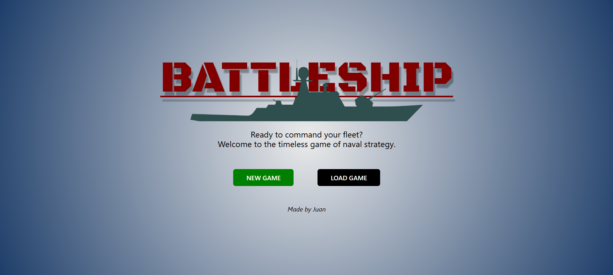
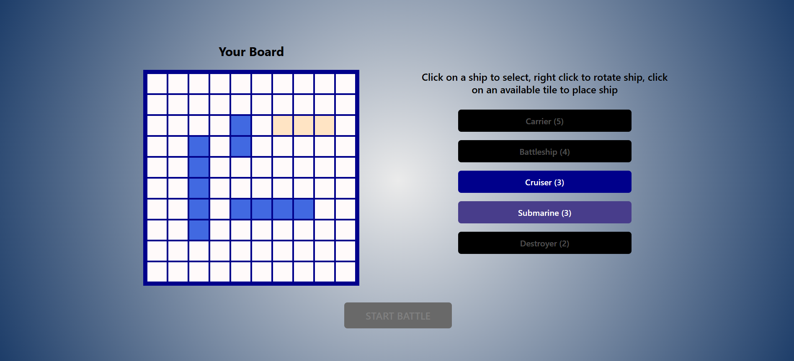
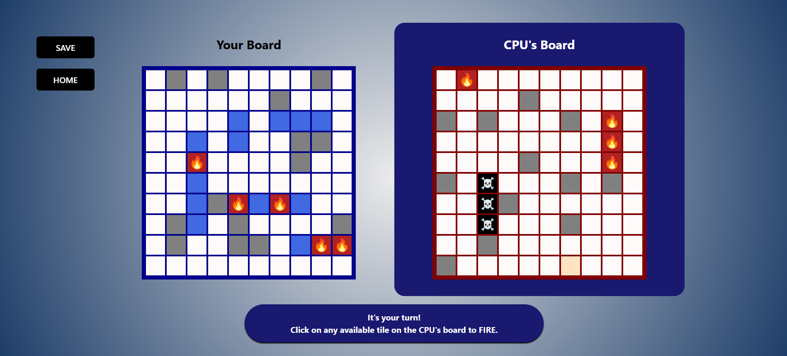
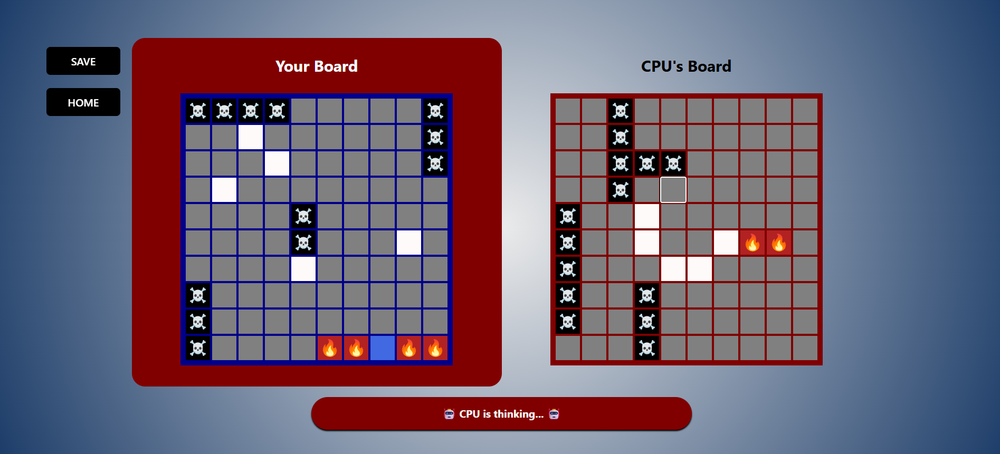
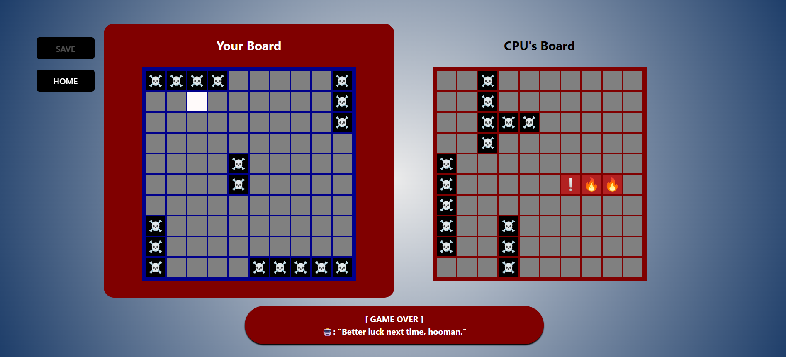
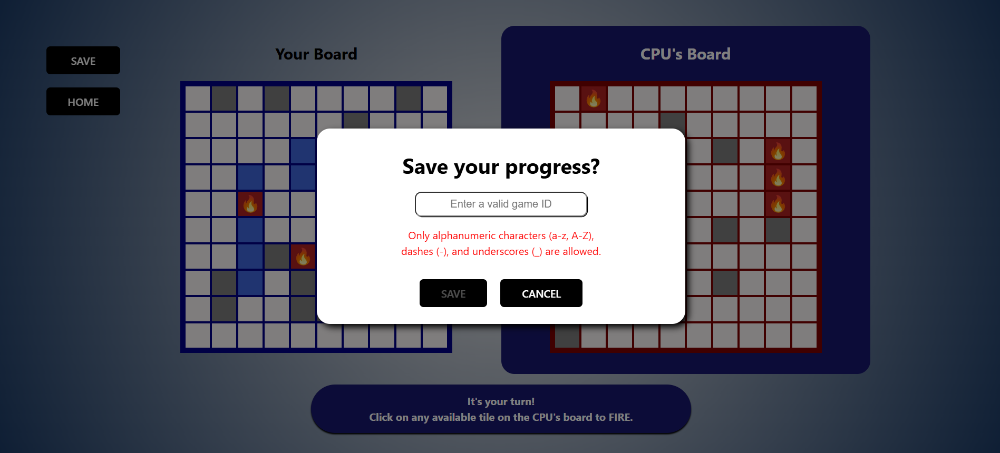

# 🛳️ battleship-juan
A single-player Battleship game built with **React, TypeScript, and CSS Modules**, developed as part of my internship at **Netizen eXperience** in mid-2024.

This project was created to apply and demonstrate practical skills in web development, project structuring, and algorithm analysis for my undergraduate practicum report under the **SQMX4908 Practicum** course.

## 📌 Project Description
This game allows players to enjoy the classic Battleship experience against a CPU opponent. It includes features such as:
- Ship placement validation (ensures no overlaps or out-of-bounds)
- CPU ship placement generation
- Turn-based hit detection
- Real-time UI rendering and updates
- Win/draw detection logic

The project was structured using React functional components with TypeScript static typing, and styled using CSS Modules for scoped component-based design. It follows a modular code structure for maintainability and is linted and formatted using [ESLint](https://eslint.org/) and [Prettier](https://prettier.io/). Development progress was managed using Git and GitHub, following [Conventional Commits](https://www.conventionalcommits.org/en/v1.0.0/) for clarity in version history.

> *🎤 [Click here](https://www.canva.com/design/DAGK99IcZWw/MtUd5l_TrEk3GopE2TF_Gw/view) to view my presentation slides that details the game's development and key decisions.*

Beyond gameplay, this project served as a case study for exploring algorithm efficiency, specifically through:
- CPU ship placement logic
- Hit detection and game loop logic

These parts were analysed and documented using **loop complexity** and **Big-O notation**.

> *🎤 [Click here](https://drive.google.com/file/d/1jqxzH47070R_UiYmtC8SE9GW4tdtesER/view?usp=sharing) to read my full practicum report (PDF).*

## 🖼️ Screenshots
Here’s a look at the gameplay:

#### Welcome stage


#### Ship placement stage


#### Battle stage, player's turn


#### Battle stage, CPU's turn


#### End game, CPU wins


#### Save game



## 🛠️ Getting Started
To run this project locally:
```bash
# Install dependencies
npm install

# Run development server
npm run dev
```

## 🔐 Notes
- The original project supported save/load functionality via an internal backend API, but this server URL has been removed from the public version due to security and privacy concerns.
- This project does not include responsive web design or accessibility features. It was developed as a scoped internship deliverable, focusing primarily on logic and front-end functionality.
- Sensitive configuration or environment files have been excluded from this repository.

## 🙏 Credits
- **Netizen eXperience** – for providing the internship placement, guidance, and development resources.
- **Yong Jian** – project mentor and company supervisor.
- **Assoc. Prof. Dr. Nazihah binti Ahmad** – university practicum supervisor.
- **Family and friends** – for their continuous support.

## ⚠️ License
This project currently has no open-source license. For inquiries regarding use or adaptation, please contact the repository owner.